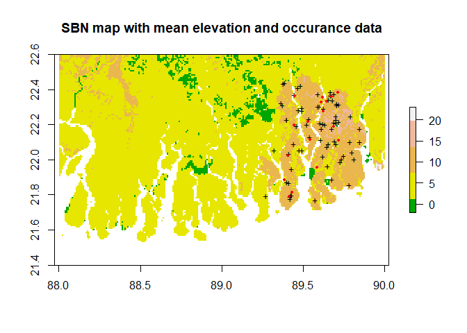
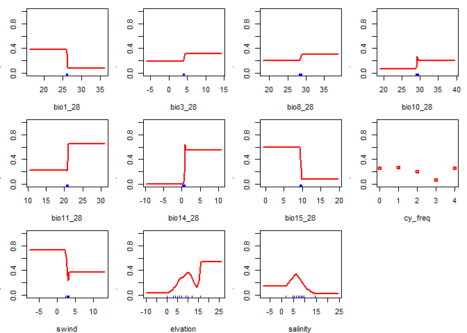
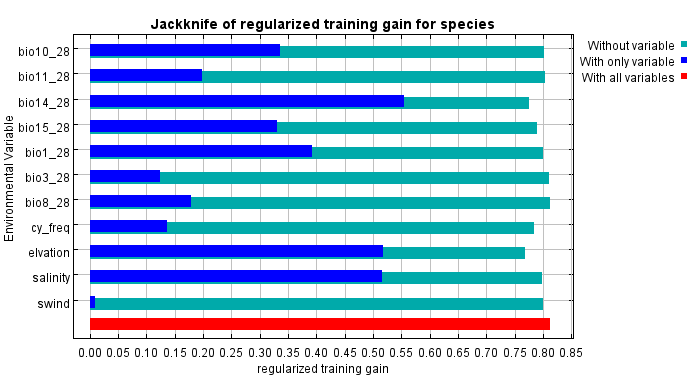
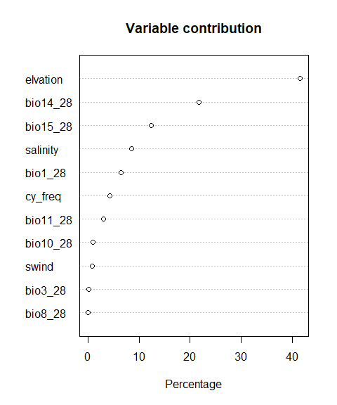
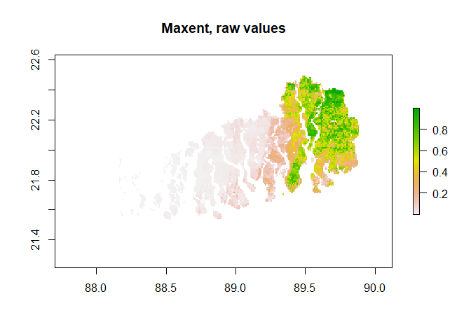
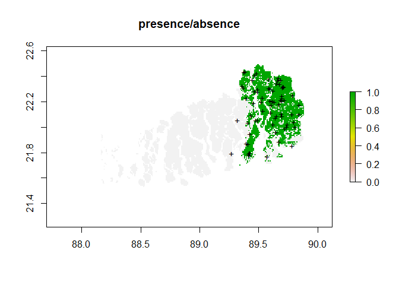
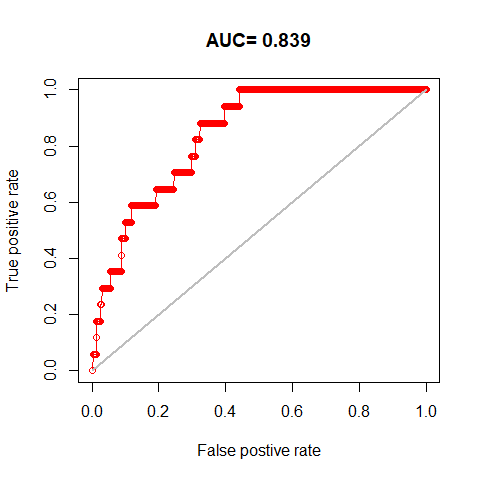

Species distribution modellig with maxent: Sundarbans mangrove forest
================
Mohammad Shamim Hasan Mandal
2/15/2021

## MaxEnt with dismo package in R

First we load required packages for our analysis. We will use the
package ‘dismo’ for our analysis. Package ‘raster’ and ’’ will be used
for raster data and vector data.

    ## Linking to GEOS 3.8.0, GDAL 3.0.4, PROJ 6.3.1

    ## Loading required package: sp

We additionally assign some optional settings for raster package for our
analysis.

### Read species occurance data

This is a csv file with only two columns, the first column is longitude
and second column in latitude. Note this order and format is mandatory
for MaxEnt.

``` r
# Occurrence data from example dataset
occ <- read.csv('./data/species.csv')
str(occ)
```

    ## 'data.frame':    89 obs. of  2 variables:
    ##  $ lon: num  89.7 89.7 89.7 89.7 89.7 ...
    ##  $ lat: num  22.4 22.4 22.4 22.3 22.3 ...

### Read environmental variables data

Next we load our predictor variables. This is raster stack with 26
variables. First 19 variables are from [WorldClim data Version
2](https://www.worldclim.org/data/bioclim.html).  

Data variable descriptions:  
1. BIO1 = Annual Mean Temperature  
2. BIO2 = Mean Diurnal Range (Mean of monthly (max temp - min temp))  
3. BIO3 = Isothermality (BIO2/BIO7) (×100)  
4. BIO4 = Temperature Seasonality (standard deviation ×100)  
5. BIO5 = Max Temperature of Warmest Month  
6. BIO6 = Min Temperature of Coldest Month  
7. BIO7 = Temperature Annual Range (BIO5-BIO6)  
8. BIO8 = Mean Temperature of Wettest Quarter  
9. BIO9 = Mean Temperature of Driest Quarter  
10. BIO10 = Mean Temperature of Warmest Quarter  
11. BIO11 = Mean Temperature of Coldest Quarter  
12. BIO12 = Annual Precipitation  
13. BIO13 = Precipitation of Wettest Month  
14. BIO14 = Precipitation of Driest Month  
15. BIO15 = Precipitation Seasonality (Coefficient of Variation)  
16. BIO16 = Precipitation of Wettest Quarter  
17. BIO17 = Precipitation of Driest Quarter  
18. BIO18 = Precipitation of Warmest Quarter  
19. BIO19 = Precipitation of Coldest Quarter  

Next three mangrove layers: above ground biomass, maximum caopy height
and basal area from ORNL Daac [Simrad et al.,
2019](https://doi.org/10.3334/ORNLDAAC/1665).

‘frq\_sampled’ raster layer is frequency of cyclone impact per pixel
from [Mandal and Hosaka et al. 2020](). This is a 30m pixels data,
resampled to match worldclim data (\~1km).

‘swind’ and ‘wwind’ is average wind speed in summer and winter months
extracted from windspeed data from WorldClim.

‘elv\_sampled’ is elevation data also downloaded from worldClim.

Finally the data were stack together using raster package function as
‘grd’ file format.

``` r
# read environmental data
predictors<- stack('./data/predictors_27.grd')
names(predictors[[23]]) <- 'cy_freq'
names(predictors[[26]]) <- 'elvation'
names(predictors[[27]]) <- 'salinity'

# names of predictors
names(predictors)
```

    ##  [1] "bio1_28"  "bio2_28"  "bio3_28"  "bio4_28"  "bio5_28"  "bio6_28" 
    ##  [7] "bio7_28"  "bio8_28"  "bio9_28"  "bio10_28" "bio11_28" "bio12_28"
    ## [13] "bio13_28" "bio14_28" "bio15_28" "bio16_28" "bio17_28" "bio18_28"
    ## [19] "bio19_28" "agb_sbn"  "hba_sbn"  "hmax_sbn" "cy_freq"  "swind"   
    ## [25] "wwind"    "elvation" "salinity"

### Dropping layers

For model simplification we will drop four layer from our predictor
raster objects

``` r
predictors<-dropLayer(predictors,c("hba_sbn","hmax_sbn","agb_sbn","wwind"))

names(predictors)
```

    ##  [1] "bio1_28"  "bio2_28"  "bio3_28"  "bio4_28"  "bio5_28"  "bio6_28" 
    ##  [7] "bio7_28"  "bio8_28"  "bio9_28"  "bio10_28" "bio11_28" "bio12_28"
    ## [13] "bio13_28" "bio14_28" "bio15_28" "bio16_28" "bio17_28" "bio18_28"
    ## [19] "bio19_28" "cy_freq"  "swind"    "elvation" "salinity"

### Calculate VIF for all the predictor variables.

We now test multicolinearity problems among our predicotr variables. We
can use vifstep function from the package ‘usdm’.

The vifsetp function uses two different strategy to exclude highly
collinear variable through a stepwise procedure. We set our threshold
value to be 10.

``` r
library(usdm)
# identify collinear variables that should be excluded
r1 <-brick(predictors)
v2 <- vifstep(r1,maxobservations=10000, th=10)
v2
```

    ## 12 variables from the 23 input variables have collinearity problem: 
    ##  
    ## bio9_28 bio17_28 bio7_28 bio12_28 bio16_28 bio18_28 bio2_28 bio6_28 bio13_28 bio4_28 bio19_28 bio5_28 
    ## 
    ## After excluding the collinear variables, the linear correlation coefficients ranges between: 
    ## min correlation ( elvation ~ swind ):  -0.003508092 
    ## max correlation ( bio15_28 ~ bio11_28 ):  0.8500406 
    ## 
    ## ---------- VIFs of the remained variables -------- 
    ##    Variables      VIF
    ## 1    bio1_28 4.571854
    ## 2    bio3_28 3.062587
    ## 3    bio8_28 4.109592
    ## 4   bio10_28 8.132268
    ## 5   bio11_28 4.863832
    ## 6   bio14_28 6.747218
    ## 7   bio15_28 4.946550
    ## 8    cy_freq 1.461199
    ## 9      swind 1.212531
    ## 10  elvation 3.268819
    ## 11  salinity 2.848596

### Based on our VIF analysis we will use only 11 precitors for our modelling.

``` r
predictors<-dropLayer(predictors,
                      c("bio2_28","bio4_28","bio5_28","bio6_28",
                        "bio7_28","bio9_28","bio12_28","bio13_28",
                        "bio16_28","bio17_28","bio18_28","bio19_28"))
names(predictors)
```

    ##  [1] "bio1_28"  "bio3_28"  "bio8_28"  "bio10_28" "bio11_28" "bio14_28"
    ##  [7] "bio15_28" "cy_freq"  "swind"    "elvation" "salinity"

### Data cleaning

For our species occurrence points we will extract environmental variable
values. Because we want to know, if there is any species occurrence
points for which there is no environmental variables values. We need to
remove these occurrences.

So, first we extract values in a data frame. Then we check whether there
is any ‘NA’ values, ‘NA’ represents ‘not available’.

``` r
# check for NA values
val <- extract(predictors, occ) # extract for each point
sum(is.na(val))                 # how many NAs
```

    ## [1] 0

``` r
#which(is.na(x), arr.ind=TRUE) # rows with NA values: 76 and 80
```

If we had any NA values, we will remove these rows from our dataframe.

``` r
# remove species with no data
occ<-occ[-c(76,80),]    # remove rows 76 and 80
dim(occ)                # Check data  
```

    ## [1] 87  2

``` r
# finally save to disk
# write.csv(occ,'species.csv', row.names = F) 
```

### Train and test set

We will divide our occurrence data with train and test sets. We will
model with train data and evaluate model performances using test data.
Because we will use random sampling, and each time we run random
sampling we need to use set.seed() so that next time we get the same
output.

``` r
# Train and test
set.seed(001)
# withhold 20% of the data for testing the model
fold <- kfold(occ, k=5)
test <- occ[fold == 1, ]
train <- occ[fold != 1, ]
```

We check the dimension of our train and test dataset

``` r
# we check dimension of our test and test set
data.frame(dim(train),dim(test))
```

    ##   dim.train. dim.test.
    ## 1         70        17
    ## 2          2         2

### Check species distribution data

``` r
# Plot the distribution map
plot(predictors[[10]], xlim=c(88,91),ylim=c(21.4,22.6), 
     col=terrain.colors(5, rev = F), 
     main='SBN map with mean elevation and occurance data')
points(train, pch='+', cex=0.8)
points(test, pch=20,col='red', cex=0.8)
```

<!-- -->

### Using R dismo package set up first maxent model.

    ## Loading required namespace: rJava

    ## This is MaxEnt version 3.4.1

    ## This is MaxEnt version 3.4.1

    ## This is MaxEnt version 3.4.1

    ## This is MaxEnt version 3.4.1

    ## This is MaxEnt version 3.4.1

    ## This is MaxEnt version 3.4.1

    ## This is MaxEnt version 3.4.1

    ## This is MaxEnt version 3.4.1

    ## This is MaxEnt version 3.4.1

    ## This is MaxEnt version 3.4.1

    ## This is MaxEnt version 3.4.1

    ## This is MaxEnt version 3.4.1

<!-- -->

``` r
# results of jackknife test
# import plot saved by maxent() function by default

```


``` r
# variable importance
plot(m1) # plot showing importance of each variable
```

<!-- -->

``` r
# evaluate model performance with test data
e1 <- evaluate(m1, p=test, a=bg, x=predictors)
```

    ## This is MaxEnt version 3.4.1 
    ## This is MaxEnt version 3.4.1

``` r
e1 # evaluation criteria
```

    ## class          : ModelEvaluation 
    ## n presences    : 17 
    ## n absences     : 6589 
    ## AUC            : 0.8390455 
    ## cor            : 0.06740608 
    ## max TPR+TNR at : 0.4007364

    ## This is MaxEnt version 3.4.1 
    ##   |                                                                              |                                                                      |   0%  |                                                                              |==================                                                    |  25%  |                                                                              |===================================                                   |  50%  |                                                                              |====================================================                  |  75%  |                                                                              |======================================================================| 100%
    ## 

``` r
# check threshold values
threshold(e1)
```

    ##                kappa spec_sens no_omission prevalence equal_sens_spec
    ## thresholds 0.9629524 0.4007364   0.1949182 0.00255529       0.4442207
    ##            sensitivity
    ## thresholds   0.2737506

``` r
# Plot maxent raw values where against predicted presence absence data

plot(pred1, main='Maxent, raw values')
```

<!-- -->

``` r
tr1 <- threshold(e1, 'spec_sens')
```

``` r
plot(pred1 > tr1, main='presence/absence')
points(train, pch='+')
```

<!-- -->

``` r
# plot ROC
plot(e1, 'ROC')
```

<!-- -->

### End of the Script
